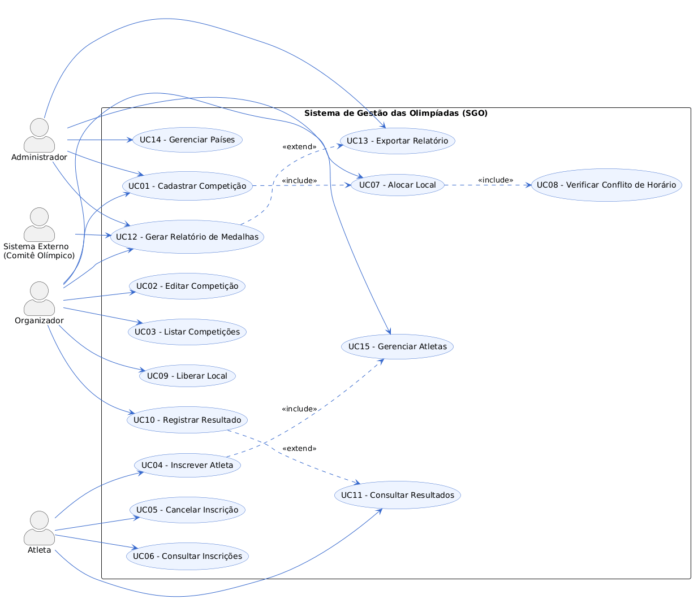
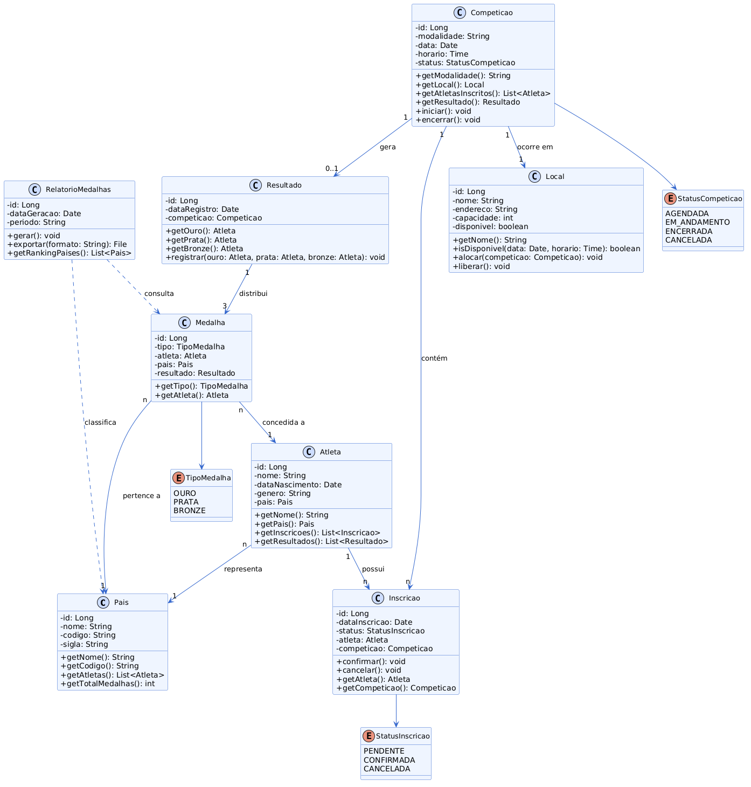
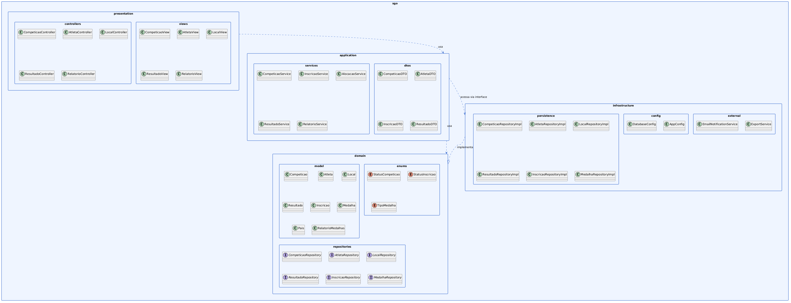
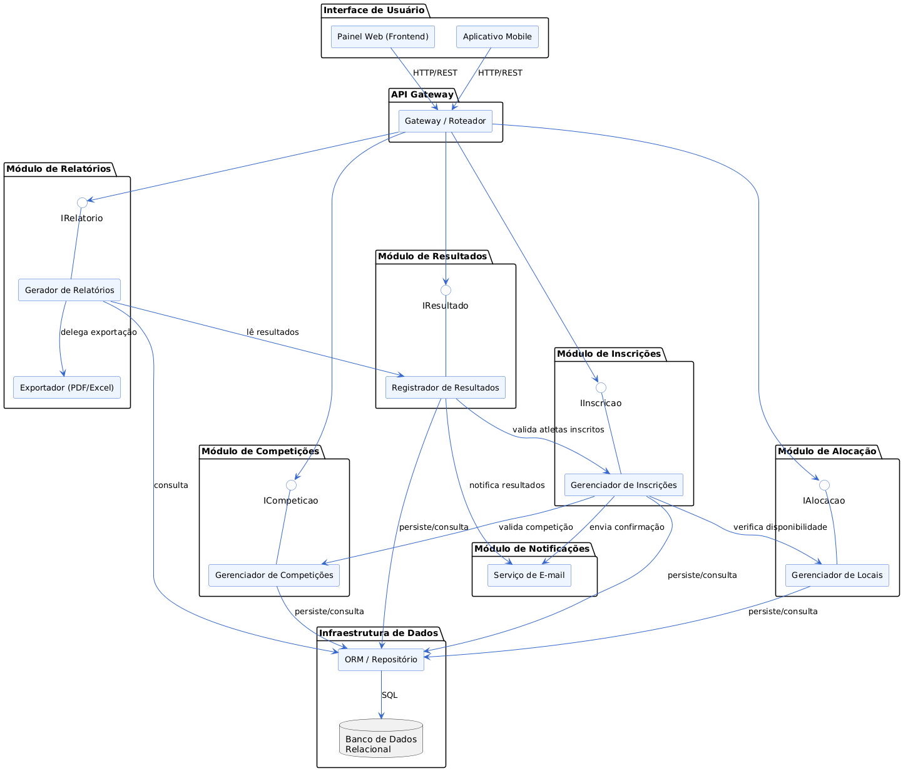
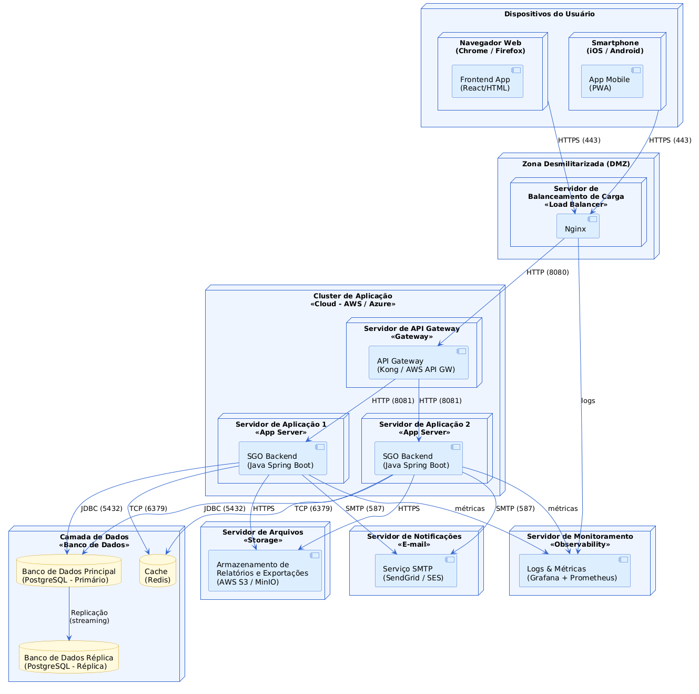

# 🏅 Sistema de Gestão das Olimpíadas (SGO)

Projeto desenvolvido para a disciplina **Projeto de Software** – PUC Minas  
**Professor:** João Paulo Carneiro Aramuni  
**Curso:** Engenharia de Software – 4º Período

---

## 📋 Descrição do Sistema

Com a chegada das Olimpíadas, o **SGO** é um sistema de gestão desenvolvido para coordenar os diferentes aspectos do evento olímpico. O sistema permite o gerenciamento de competições, inscrições de atletas, alocação de locais para as provas e controle de resultados, além de gerar relatórios de medalhas por país.

---

## 📌 Regras de Negócio

1. **Cadastro de Competições:** O sistema permite o cadastro de competições com nome da modalidade, data, horário, local e lista de atletas inscritos.
2. **Inscrição de Atletas:** Atletas de diferentes países se inscrevem em competições específicas. Cada atleta pode participar de várias competições, mas só pode representar um país por modalidade.
3. **Alocação de Locais:** Os locais são alocados de forma a evitar conflitos de horário — um local só pode abrigar uma competição por vez.
4. **Controle de Resultados:** Após as competições, os resultados são registrados com 1º, 2º e 3º lugares.
5. **Relatórios de Medalhas:** O sistema gera relatórios com o desempenho de cada país em medalhas de ouro, prata e bronze.

---

## 📖 Histórias de Usuário

### US01 – Cadastrar Competição

**Como** organizador,  
**Quero** cadastrar uma nova competição informando modalidade, data, horário e local,  
**Para que** o evento possa ser oficialmente registrado no sistema.

---

### US02 – Inscrever Atleta em Competição

**Como** atleta,  
**Quero** me inscrever em uma competição representando meu país,  
**Para que** eu possa participar oficialmente do evento olímpico.

---

### US03 – Alocar Local para Competição

**Como** organizador,  
**Quero** alocar um local para uma competição verificando conflitos de horário,  
**Para que** não haja dois eventos simultâneos no mesmo espaço físico.

---

### US04 – Registrar Resultado de Competição

**Como** organizador,  
**Quero** registrar o resultado de uma competição indicando os atletas em 1º, 2º e 3º lugar,  
**Para que** as medalhas sejam distribuídas corretamente.

---

### US05 – Gerar Relatório de Medalhas

**Como** administrador,  
**Quero** gerar um relatório com o total de medalhas (ouro, prata e bronze) conquistadas por cada país,  
**Para que** o desempenho das delegações possa ser avaliado e divulgado.

---

### US06 – Consultar Competições Disponíveis

**Como** atleta,  
**Quero** consultar a lista de competições disponíveis com data, horário e local,  
**Para que** eu possa me planejar e realizar minhas inscrições.

---

### US07 – Cancelar Inscrição

**Como** atleta,  
**Quero** cancelar minha inscrição em uma competição antes do início do evento,  
**Para que** minha vaga possa ser disponibilizada para outro atleta.

---

### US08 – Exportar Relatório de Medalhas

**Como** administrador,  
**Quero** exportar o relatório de medalhas em formato PDF ou Excel,  
**Para que** ele possa ser compartilhado com o Comitê Olímpico.

---

### US09 – Gerenciar Países e Atletas

**Como** administrador,  
**Quero** cadastrar, editar e remover países e atletas no sistema,  
**Para que** as informações do quadro de participantes estejam sempre atualizadas.

---

### US10 – Verificar Disponibilidade de Local

**Como** organizador,  
**Quero** verificar a disponibilidade de um local em uma data e horário específicos,  
**Para que** eu possa alocar competições sem conflitos.

---

## 🗂️ Diagramas UML

### 📌 Diagrama de Caso de Uso



---

### 📌 Diagrama de Classes



---

### 📌 Diagrama de Pacotes



---

### 📌 Diagrama de Componentes



---

### 📌 Diagrama de Implantação



---

## 📁 Estrutura do Repositório

```
sistema-gestao-olimpiadas/
│
├── README.md
│
├── imagens/
│   ├── diagrama-de-caso-de-uso.png
│   ├── diagrama-de-classes.png
│   ├── diagrama-de-pacotes.png
│   ├── diagrama-de-componentes.png
│   └── diagrama-de-implantacao.png
│
└── codigos/
    ├── diagrama-de-caso-de-uso.puml
    ├── diagrama-de-classes.puml
    ├── diagrama-de-pacotes.puml
    ├── diagrama-de-componentes.puml
    └── diagrama-de-implantacao.puml
```

---

## 🛠️ Tecnologias Utilizadas

- [PlantUML](https://plantuml.com/) – Geração dos diagramas UML
- [PlantUML API](https://github.com/joaopauloaramuni/projeto-de-software/tree/main/PROJETOS/Python/Projeto%20PlantUML%20API) – Renderização via API

---

## 📚 Referências

- [PlantUML Language Reference Guide](https://plantuml.com/guide)
- [PlantUML Site Oficial](https://plantuml.com/)

---

## 📄 Licença

Este projeto está sob a Licença MIT.
